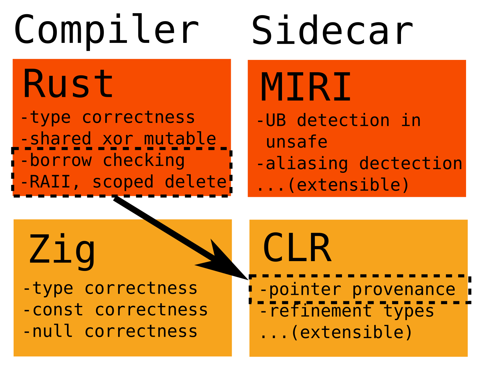

# CLR

**C**hecker of

**L**ifetimes and other

**R**efinement types

for Zig

discuss on hn: https://news.ycombinator.com/item?id=42923829

discuss on lobste.rs:  https://lobste.rs/s/9sitsj/clr_checker_for_lifetimes_other

live demo video:  https://www.youtube.com/watch?v=ZY_Z-aGbYm8

## TL;DR
This repository is an incomplete proof-of-concept implementation of borrow checking (and other goodies) for Zig, done
by analyzing zig's "AIR" intermediate representation.

## Q&A:

Q: Why the hell did you write this in Elixir?
> A: I'm fastest at Elixir. It would have taken me more than 2 months to do this in any other language.
>
>   This was a good decision, actually:
>   - I got a chance to see if it was possible to easily parallelize analysis and "lazily"
>     call functions with "await"-style callbacks.  Answer: yes.
>   - I wasn't tempted to try to build hooks to get the zig compiler itself to output
>     AIR in, say, a binary format.  This would have taken me waaay longer to get to a basic 
>     proof-of-concept

Q: When will you complete this so I can use this?
> A: You shouldn't use this software.  
>   This software is strictly to "prove it can be done".  I am leaving tech and launching a biotech
>   startup, I really wanted to scratch this one last itch before diving fully into fundraising.
>   - Debug AIR output is incomplete, so for more complex cases, it would necessarily spectacularly fail.
>   - I haven't implemented even basic control flow (aside from function calls).  I'm pretty sure it's
>     possible, but I haven't worked out the exact logic necessary.

Q: What is the biggest take-home?
> A: If the Zig project makes a plan to (eventually) allow for the standardization and export of AIR (no rush!!)
>   this is an ideal target for static checking with refinement types.  I contend that zig + refinement types
>   can be ~rust-level memory-safe.

Q: You didn't do *X*, so Zig will never be able to track *X*
> A: Maybe.  Only way to know for sure is to fork this (or, hopefully, a 'real' successor) and fail.
> However, consider that "trivially" it should be possible to externally annotate every zig file with
> lifetime/type annotations identical to that of Rust and run "exactly the same" analysis as Rust and
> get the same memory safety as Rust.

Q: I'm interested in writing a real CLR for zig.  Do you have any advice?
> A: Please steal the very clever name of my project.  Don't write it in Elixir.

Q: If you're leaving tech, what will happen to [Zigler](https://github.com/e-xyza/zigler)?
> A: I have promised to maintain zigler until Zig reaches 1.0.  I will be looking for maintainers for my other projects.

## About me

Hi!  I'm Isaac Yonemoto, I'm a longtime developer, mostly in the Elixir and Zig programming languages.
You can find a youtube video showcasing my industry work here:  https://www.youtube.com/watch?v=rXBYamvsAVQ

I used to be a biochemist, and then I left the academic path and attempted to start a nonprofit 
research effort; then after completing one project, in order to make ends meet I became a software
developer, and have been in the software industry for almost a decade, mostly in AI, and AI 
orchestration.  I've decided to quit the software industry and go back to my biochemistry roots, and 
I'm doing [my own startup](https://vidalalabs.com) (if you know investors that like to bet on relatively
unknown polymaths send them to me!)

I had a few months before going deep into fundraising for my startup, so I was wondering what I could do
in a short time with maximal impact, and this is what I decided to do.

## The General Idea



Zig is a famously "unsafe" language.  Memory management is done manually, which opens up the possibility
of having implementation errors in the code.  While many security issues are due to logical 
implementation errors, memory safety errors are a large and real surface area for released software.
The Zig programming language reduces the security issues relative to C, by eliminating out of bounds
array access and null pointer dereferencing in safety-checked code, but is still less safe
than Rust, which is able to eliminate use-after-free, double-free, and data races, as its compiler
performs static analysis on the code guaranteeing that these errors cannot happen in safety-checked
code.

In the case of Rust, these errors *can* happen in "unsafe" code, so for projects where a higher degree
of safety is required, the `MIRI` project is a 'sidecar' project that can interpret rust code (or
specifically compiler intermediates of rust code) that can understand unsafe code as well as perform
other analyses on rust code preventing a deeper class of security or logical regression.

Inspired by this, I decided to explore if 'sidecar' software can be written to perform static analysis
on Zig intermediates and achieve a higher degree of safety than that which zig provides out-of-the-box.

The Zig compilation pipeline is as follows:

1. Zig Code / AST
2. Zig ZIR (untyped, per-file intermediate representation)
3. Zig AIR (typed, per-function IR, reified for polymorphic functions)
4. Compiler targets

I decided that Zig AIR would be the correct level to perform analysis.  AIR is very good
because it's interpretable as sort of a "minimum viable" list of generalized programming
instructions -- as it's designed to be interchangeable and consumed by different compilers
which themselves might produce intermediate representations to optimize code.  Optimized
code might be too specialized to conveniently do static analysis; and a earlier level of 
intermediate might require more analysis, for example, if a polymorphic function needs
to be reified multiple times depending on the passed type with separate code paths.

Moreover, since AIR is typed, we can extend the types flowing through AIR with
metadata, which is a form of *refinement typing*.

Let's take a look at a basic example of Zig AIR:

for the following zig code (in the `foobar` namespace):

```zig
fn add_10(x: anytype) @TypeOf(x) {
   return x + 10;
}
```

the following AIR is emitted when x is `u8`:

```
# Begin Function AIR: foobar.add_10__anon_2998:
# Total AIR+Liveness bytes: 397B
# AIR Instructions:         13 (117B)
# AIR Extra Data:           30 (120B)
# Liveness tomb_bits:       8B
# Liveness Extra Data:      6 (24B)
# Liveness special table:   3 (24B)
  %0 = arg(u8, "x")
  %1!= dbg_stmt(2:13)
  %2 = add_with_overflow(struct { u8, u1 }, %0!, <u8, 10>)
  %3 = struct_field_val(%2, 1)
  %4 = cmp_eq(%3!, <u1, 0>)
  %7!= block(void, {
    %8!= cond_br(%4!, likely {
      %9!= br(%7, @Air.Inst.Ref.void_value)
    }, cold {
      %2!
      %5!= call(<fn ([]const u8, ?*const builtin.StackTrace, ?usize) noreturn, (function 'defaultPanic')>, [<[]const u8, "integer overflow"[0..16]>, <?*const builtin.StackTrace, null>, <?usize, null>])
      %6!= unreach()
    })
  } %4!)
  %10 = struct_field_val(%2!, 0)
  %11!= dbg_stmt(2:4)
  %12!= ret_safe(%10!)
# End Function AIR: foobar.add_10__anon_2998
```

Note that the function name is `add_10__anon_2998` which is a *reification* of the abstract
function `add_10` (in this case when the 0th parameter is `u8`).

Stepping through:

- 0: set this slot to the 0th passed argument.
- 1: we are on line 2, column 13 (relative to function head)
- 2: set this slot to the tuple {slot 0 + (literal `u8` value 10), `u1` overflow?}
- 3: set this slot to the extracted 1th field of slot 2 (that's the `u1` field)
- 4: set this slot to true if slot 3 is 0?
- 7: block
- 8: branch if slot 4
- 9: (slot 4 true) break out of block 7
- 5: (slot 4 false) call the defaultPanic function
- 6: (slot 4 false) unreachable
- 10: set this slot to the extracted 0th field of slot 2 (that's the add ten result)
- 11: we are on line 2, column 4
- 12: return the contents of slot 10.

for a more in-depth look at how Zig's AIR works, I recommend Mitchell Hashimoto's fantastic
blog post: https://mitchellh.com/zig/sema (note that the structure of Zig AIR has changed since
this blog post too, reflecting the current volatility in Zig compiler)

Analyzing AIR turned out to be a good decision, and from this project I conclude that Zig AIR is
a *very* good target for many classes of static analysis on Zig code.

The question I'd like, then, for dear reader to consider for the future, when a *Real CLR* is built for
zig is:  If you really want MIRI for security-conscious rust projects *anyways*, why not pick a simpler 
language and do a MIRI-style analysis to get borrow checking and other refinement-type analysis?  This
project shows that such a future is a real possibility.

## Specific Examples

This CLR analyzer has been instrumented with four different types of tests:
- Undefined use
- Stack Pointer escape
- Allocation Mistakes
- Unit Tracking

### Undefined Use

In Zig, setting a value to undefined in debug modes fills the data with `0xAAAA...` but in unsafe release
modes for performance reasons it may remain undefined behaviour (it might take the value of whatever
happens to be in memory at the time).  It is, indeed possible, to treat `undefined` as a poison value
and track locations where values are `undefined` and prohibit propagation and attempted use of these
poison values.

#### In action

[code](./test/integration/undefined/undefined_value_use.zig)
```
$ mix clr run test/integration/undefined/undefined_value_use.zig
** (Mix) Use of undefined value in function undefined_value_use.main (test/integration/undefined/undefined_value_use.zig:3:5).
Value was set undefined in function undefined_value_use.main (test/integration/undefined/undefined_value_use.zig:2:5)
```

Note that passing a pointer to an undefined vaule is generally valid (the calling function might take it as an *in-out* parameter
and set the value of the pointed parameter), so CLR passes the undefined status of the *interior* value and prohibits you from
using it (as undefined) in the called function.  If you elsewhere call the function with a pointer that isn't undefined it should
redo the analysis with different refinement metadata and allow the function to pass checks.


[code](./test/integration/undefined/undefined_value_passed.zig)
```
$ mix clr run test/integration/undefined/undefined_value_passed.zig
** (Mix) Use of undefined value in function undefined_value_passed.deref_ptr (test/integration/undefined/undefined_value_passed.zig:2:3).
Value was set undefined in function undefined_value_passed.main (test/integration/undefined/undefined_value_passed.zig:6:5)
```

#### Under the hood

This is what it looks like in AIR when zig sets a value to undefined:

```
# Begin Function AIR: undefined_value_use.main:
# Total AIR+Liveness bytes: 513B
# AIR Instructions:         21 (189B)
# AIR Extra Data:           38 (152B)
# Liveness tomb_bits:       16B
# Liveness Extra Data:      7 (28B)
# Liveness special table:   3 (24B)
  %0!= dbg_stmt(2:5)
  %1 = alloc(*u8)
  %2!= store_safe(%1, <u8, undefined>)
...
```

it's pretty easy for CLR to see this and assign the correct metadata to the variable.

#### Other comments

It might generally be correct to prohibit passing or returning an undefined value, but that wasn't explored in this
implementation.

### Stack Pointer Escape

In Zig, returning a pointer to data on the stack is one of the easiest memory safety mistakes you can make.  Usually
at runtime this will cause a segfault, and luckily Zig has some very nice segfault tracking conveniences.  However,
it would probably be even better to detect this at compile time, especially as in some cases the escape might be
conditional and not frequently triggered in your release environment.

Here's a very simplified example of stack pointer escape:

```zig
fn escaped_ptr() *u32 {
  var foo: u32 = 0;
  foo += 1;
  return &foo; 
}
```

#### In action

when it's a pointer to a function parameter:


[code](./test/integration/stack_pointer/param_ptr_escape.zig)
```
$ mix clr run test/integration/stack_pointer/param_ptr_escape.zig
** (Mix) Escape of stack pointer in function param_ptr_escape.escaped_param_ptr (test/integration/stack_pointer/param_ptr_escape.zig:2:3).
Value was created in function param_ptr_escape.escaped_param_ptr (test/integration/stack_pointer/param_ptr_escape.zig:1, argument 0)
```

when it's a pointer to a stack-created variable.


[code](./test/integration/stack_pointer/stack_ptr_escape.zig)
```
mix clr run test/integration/stack_pointer/stack_ptr_escape.zig 
** (Mix) Escape of stack pointer in function stack_ptr_escape.escaped_ptr (test/integration/stack_pointer/stack_ptr_escape.zig:4:3).
Value was created in function stack_ptr_escape.escaped_ptr (test/integration/stack_pointer/stack_ptr_escape.zig:2:3)
```

#### Under the hood

Stack allocation is denoted by the AIR instruction `alloc`, which creates a pointer on the stack exactly to the type
of data being created.  This value can later be written to using a `store_*` instruction which writes to that pointer.
Later, we see a `ret_*` pointer returning a value from at the location pointed to by the slot where the allocation
targeted.  By annotating that slot as containing a stack pointer identified as belonging to this function, we can prevent
escape of the stack pointer even if the stack or parameter variable pointer is consumed and returned by a called function.

> #### Warning
> note that this strategy will fail in the case where recursion is used.  Future versions of zig are likely to
> make recursive strategy only be allowed within explicitly allocated stack or heap frames, necessitating an async
> strategy -- in such a case better tracking of recursed stack pointers through annotation is likely to be possible.

```
# Begin Function AIR: stack_ptr_escape.escaped_ptr:
# Total AIR+Liveness bytes: 487B
# AIR Instructions:         19 (171B)
# AIR Extra Data:           36 (144B)
# Liveness tomb_bits:       16B
# Liveness Extra Data:      7 (28B)
# Liveness special table:   3 (24B)
  %0!= dbg_stmt(2:3)
  %1 = alloc(*u32)
  %2!= store_safe(%1, <u32, 0>)
...
  %18!= ret_safe(%1!)
# End Function AIR: stack_ptr_escape.escaped_ptr
```

### Allocation Mistakes

Zig famously doesn't have RAII.  Part of zig's philosophy is to have no implicit function calls; so any destructors
which must complete cleanup operations are antithetical to Zig's design.  However, are implicit destructors necessary?
Instead one could verify that only one code branch is qualified to cleanup a resource.  One thing that might make this 
extremely easy is that optional typing in zig is a first-class citizen.  Using a CLR-like tool will effectively make a
C-like "schroedinger's pointer" that is *maybe-deleted* impossible and instead force you to nullify such a pointer and 
explicitly declare the pointer datatype as a nullable.

#### In action

The Allocator unit is the most complex unit in this proof-of-concept.  The following mistakes are checked:

- use after free

[code](./test/integration/allocator/use_after_free.zig)
```
$ mix clr run test/integration/allocator/use_after_free.zig
** (Mix) Use after free detected in function use_after_free.main (test/integration/allocator/use_after_free.zig:7:5).
Pointer was freed in function use_after_free.main (test/integration/allocator/use_after_free.zig:6:18)
```

- double free

[code](./test/integration/allocator/double_free.zig)
```
$ mix clr run test/integration/allocator/double_free.zig
** (Mix) Double free detected in function double_free.main (test/integration/allocator/double_free.zig:6:18).
Previously freed in function double_free.main (test/integration/allocator/double_free.zig:5:18)
```

- double free after transferring provenance to another function

[code](./test/integration/allocator/free_after_transfer.zig)
```
$ mix clr run test/integration/allocator/free_after_transfer.zig 
** (Mix) Double free detected in function free_after_transfer.main (test/integration/allocator/free_after_transfer.zig:10:18).
Previously freed in function free_after_transfer.function_deletes (test/integration/allocator/free_after_transfer.zig:4:18)
Pointer was transferred to free_after_transfer.function_deletes
```

- calling a function with a freed pointer

[code](./test/integration/allocator/call_with_freed.zig)
```
$ mix clr run test/integration/allocator/call_with_freed.zig
** (Mix) Function call `do_nothing` in function call_with_freed.main (test/integration/allocator/call_with_freed.zig:10:23) was passed a freed pointer (argument 0).
Pointer was freed in function call_with_freed.main (test/integration/allocator/call_with_freed.zig:9:18)
```

- returning a freed pointer

[code](./test/integration/allocator/returns_freed.zig)
```
$ mix clr run test/integration/allocator/returns_freed.zig
** (Mix) Function return in function returns_freed.returns_freed (test/integration/allocator/returns_freed.zig:6:5) returned a freed pointer.
Pointer was freed at function returns_freed.returns_freed (test/integration/allocator/returns_freed.zig:5:18)
```

- attempting to free with the wrong allocator

[code](./test/integration/allocator/mismatched_allocator.zig)
```
$ mix clr run test/integration/allocator/mismatched_allocator.zig 
** (Mix) Heap memory attempted to be freed by `heap.c_allocator_vtable` in function mismatched_allocator.main (test/integration/allocator/mismatched_allocator.zig:6:19).
Originally allocated by `heap.PageAllocator.vtable`
```

- attempting to free a stack pointer

[code](./test/integration/allocator/starck_free.zig)
```
$ mix clr run test/integration/allocator/stack_free.zig 
** (Mix) Stack memory attempted to be freed by allocator `heap.c_allocator_vtable in function stack_free.main (test/integration/allocator/stack_free.zig:5:18).
Pointer was created in function stack_free.main (test/integration/allocator/stack_free.zig:4:5)
```

- leaking memory

[code](./test/integration/allocator/leaks.zig)
[code](./test/integration/allocator/leaked_from_function_return.zig)
```
$ mix clr run test/integration/allocator/leaks.zig 
** (Mix) Function return at function leaks.main (test/integration/allocator/leaks.zig:5:3) leaked memory allocated in function leaks.main (test/integration/allocator/leaks.zig:4:23)

$ mix clr run test/integration/allocator/leaked_from_function_return.zig
** (Mix) Function return at function leaked_from_function_return.main (test/integration/allocator/leaked_from_function_return.zig:9:3) leaked memory allocated in function leaked_from_function_return.allocate_for_me (test/integration/allocator/leaked_from_function_return.zig:4:22)
```

> #### Note
>
> some of these mistakes have runtime checks performed by zig and also have runtime messages emitted.
> the Zig general purpose allocator has the ability to check for leaks at runtime on deinitialization;
> but a static checker can do so for any allocator which implements the zig allocator interface.

#### Under the Hood

This is what a create/destroy cycle looks like in Zig AIR:

```
  %2 = call(<fn (mem.Allocator) error{OutOfMemory}!*u8, (function 'create__anon_2535')>, [<mem.Allocator, .{ .ptr = undefined, .vtable = heap.c_allocator_vtable }>])
  ...
  %11!= call(<fn (mem.Allocator, *u8) void, (function 'destroy__anon_2541')>, [<mem.Allocator, .{ .ptr = undefined, .vtable = heap.c_allocator_vtable }>, %8])
```

The create and destroy functions have unique reification for each type created by allocators.  The Allocators
module can intercept and cancel the processing of calls to functions it identifies are calls to the Zig
allocator interface by recognizing the `mem.Allocator` type of the literal in the first argument; and can
identify if it's a `create` or `destroy` operation by checking the function name.

In general an AIR analysis tool SHOULD intercept known zig standard library functions when it makes sense.
In some cases, the lifecycle of a datatype might require other initialization and setup (by informal convention 
called `new`/`delete` in the Zig ecosystem), and custom AIR modules might be able to track OOP-like provenance
for groups of data by intercepting known functions instead of tracking each subcomponent of a datatype.

> #### Implementation bounds
> in this CLR proof of concept, only create/destroy pairs were implemented; alloc/free pairs are not tracked.

#### Limitations

Allocator tracking is probably only going to be able to be done on a type-by-type basis.
If you have multiple instantiations of an allocator type (for example, "one arena per chat room", or 
"one heap per thread"), it might require more complicated logic to ensure that these allocators
respect additional boundaries on the use of these allocators, or, it might simply not be possible.

Currently Zig does not have a first-class async continuation system in the programming language.  This
implementation of AIR also did not provide affordances for sharing pointers via globals / channel-like
mechanisms across thread boundaries.  As a consequence the "mutable xor shared" conceptual framework 
was not implemented.  It is likely that these situations might require explicitly specifying pointer 
provenance using extra metadata binding (see next section).

### Unit Tracking

The Unit Tracking module flexes the power of refinement type tracking in CLR, but more generally
shows you what sorts of things you could do, and strategies to richly annotate datatypes in in zig *without changing 
the language*.

> #### Warning
> in this proof of concept, only addition and multiplication have been implemented for Unit Tracking.

#### In action

[code](./test/integration/units/unit_conflict.zig)
```
$ mix clr run test/integration/units/unit_conflict.zig 
** (Mix) Mismatched units found in function unit_conflict.main (test/integration/units/unit_conflict.zig:27:15).
Left hand side: m/s
Right hand side: ft/s
```

#### Brief Overview

The meat of the error comes from this part:

```zig
  var v1 = set_units(10.0, "m/s");
  ...
  var v2 = set_units(10.0, "ft/s")
  ...
  var v3 = v1 + v2;
```

By knowing that `v1` and `v2` are `f32-m/s` and `f32-ft/s` and knowing that an addition *requires* matched
units, the Unit module can return its Mismatched Unit error.

```zig
var _unit: [:0]const u8 = undefined; // dummy variable, but necessary for analysis
const debug = true;  // this could be set at compile time

fn set_units(value: f32, comptime unit: anytype) f32 {
  if (debug) _unit = unit;  // compiled out in non-debug builds
  return value;  // in non-"debug" builds this compiles out to an inlined nothingburger
}
```

The secret sauce is the magic `set_units` function.  This function "compiles out to nothing" if you set
the `debug` variable to false, so in principle it's possible to make this a zero-cost component.  The
Unit Tracking module can special-case the `set_units` function and examine the internal AIR of each reified
version of `set_units`.  As the datatype is a compile-time known string, CLR can see this in the AIR
data and assigning the resulting "unit" tracked by interpreting AIR as refinement type metadata.

This is what the AIR looks like for one of the reified set_units calls in the code; it is then
easy to associate "unit" metadata with the corresponding `set_units__anon_5420` function:

```
# Begin Function AIR: unit_conflict.set_units__anon_5420:
# Total AIR+Liveness bytes: 224B
# AIR Instructions:         8 (72B)
# AIR Extra Data:           10 (40B)
# Liveness tomb_bits:       8B
# Liveness Extra Data:      0 (0B)
# Liveness special table:   0 (0B)
  %0 = arg(f32, "value")
  %1!= dbg_stmt(2:7)
  %3!= dbg_stmt(2:14)
  %4!= store_safe(<*[:0]const u8, unit_conflict._unit>, <[:0]const u8, "m/s/s"[0..5]>)
  %6!= dbg_stmt(3:3)
  %7!= ret_safe(%0!)
# End Function AIR: unit_conflict.set_units__anon_5420
```

#### Other comments

It's easy to imagine extending something like this to other datatypes which require lifetime
tracking and provenance, for example anything that requires a file descriptor, which is an integer 
under the hood.

## Things I didn't do

Zig CLR is incomplete!  It's time for me to move on to my biotech venture, as this itch has been
sufficiently scratched.  I am thoroughly convinced that 'safe' zig is possible, and maybe not 
that hard, since Zig's AIR is implemented at a level of richness that is almost exactly what
you want to do these sorts of things.  That said, there are several (and kinda several huge things)
that have been left undone:

- Control flow.  Proper control flow analysis will require creating a separate analytical pathway
  for all conditional branches or looping events and performing a reconciliation step.  This is
  probably easy in Elixir (since values are immutable) but is likely to have huge footguns.

- supporting any zig command besides `run`.  Originally `mix clr` was supposed to support multiple
  modalities, but I didn't get around to that.

- configuration for analysis modules.  In this Zig CLR code, each analysis module is implemented as a 
  struct-bearing module.  This struct is passed into every invocation of instruction analysis,
  but it's always a struct with no fields!  That's because I didn't have the time or inspiration
  to implement options on the analysis.  But in principle, this should be possible

- modules or external imports.  I have no idea if running this CLR with modules or external file 
  imports works.  It might not.  I just did as bare-bones an implementation as I could to prove
  to myself (and hopefully you) that static analysis of ZIR makes sense.

## Things I wish I had (What next for zig?)

The biggest annoying point I ran into while building CLR is that the `dbg_stmt`, which annotates 
row/column for a function, is a row/column relative to the function head itself.  within the AIR
metadata itself, it doesn't seem like function file and code row are accessible.  Luckily, I 
remembered that I had written a [Zig Parser](http://github.com/e-xyza/zig_parser) so
using this as a dependency made creating sane function errors relatively easy.  I don't consider
this to be required in the 'textual' AIR analysis dump, but it would be nice.

Moving forward, I think the Zig team should really consider building a plan to not just lock down 
the language, but to also specify and lock down AIR, ideally with a standardized binary serialization
protocol.  Even promising to do this eventually (and even if it will be long past 1.0) will give
toolmakers the green flag to start working on this, if they're willing to accept thrash in the AIR
format and not complain about it.

Should Zig have this as a main part of the language?

I think not.  To some degree, clr or any analytical tool relies on `convention` in a way that the
core language should be free of.  Maybe it's just my opinion, but it feels *against the spirit of zig* 
to create a hard dependence on an interface *loosely* defined in the stdlib.  That said, if the Zig 
team wanted to take it on a CLR-like as a part of the foundation (giving it the level of attention 
as, say, a language server) I think that would be a good idea.  Though as I said earlier, you
probably shouldn't use this code as anything more than proof of concept or spiritual inspiration.

## Conclusion

https://twitter.com/DNAutics/status/1839454740167663866

> If rust were "zig but with borrow checking" it would be an awesome language.
> ...
> I think writing a borrow checker for zig will be extremely easy if they let you export AIR data

Ok, so maybe it wasn't *extremely easy* but it wasn't that hard to get started either.
